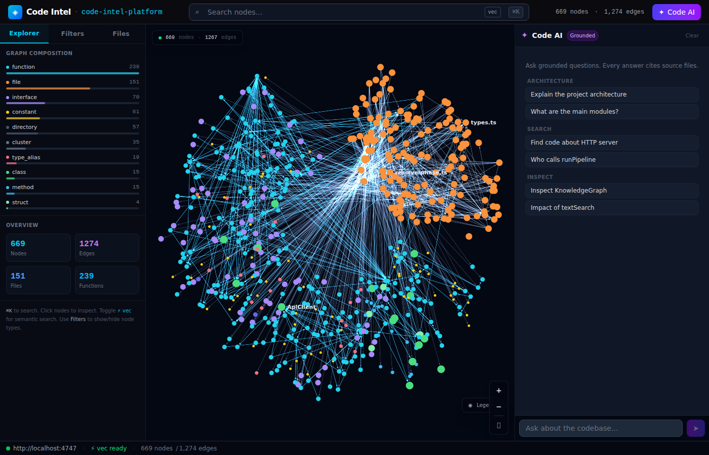

# Code Intelligence Platform

A static code analysis platform that builds a **Knowledge Graph** from your source code and makes it explorable through a Web UI, HTTP API, CLI, and MCP server.



---

## ✨ Features

- **Knowledge Graph** — parses 14+ languages into nodes (functions, classes, files, etc.) and edges (calls, imports, extends, etc.)
- **Force-directed Graph Explorer** — interactive Sigma.js visualization with color-coded node types, hover highlighting, and filters
- **Semantic Vector Search** — embeddings via `all-MiniLM-L6-v2` stored in LadybugDB vector index for natural-language code search
- **BM25 Text Search** — keyword-based search with reciprocal rank fusion
- **Code AI Chat** — grounded assistant that cites source files in every answer
- **LadybugDB Persistence** — graph and vector index stored as embedded graph database
- **HTTP API** — REST endpoints for graph, search, inspect, blast radius, flows
- **MCP Server** — Model Context Protocol integration for LLM tooling
- **CLI** — analyze, serve, search, inspect, impact commands with animated `█░` progress bars and braille spinners
- **Multi-language** — TypeScript, JavaScript, Python, Java, Go, C, C++, C#, Rust, PHP, Ruby, Swift, Kotlin, Dart (14 languages via tree-sitter AST)
- **Incremental Analysis** — `--incremental` flag re-parses only git-changed/mtime-changed files; 10k-file repo with 3 changes: 288ms
- **Parallel Analysis** — `--parallel` flag runs parse + resolve phases on worker threads for large repos
- **AI Context Files** — auto-generates `AGENTS.md` + `CLAUDE.md` at project root after every analysis with live stats, CLI reference, and skill links
- **Skill Files** — generates `.claude/skills/code-intel/` with per-cluster SKILL.md files (hot symbols, entry points, impact guidance) for AI assistants
- **Repository Groups** — multi-repo / monorepo service tracking with contract extraction and cross-repo dependency detection
- **`.codeintelignore`** — exclude directories from analysis (like `.gitignore` but for code-intel)
- **Structured Logging** — winston-based logger with daily-rotating log files at `~/.code-intel/logs/`, sensitive-data masking, and configurable log levels
- **Performance** — parallel batch file I/O, shared file cache (zero double-reads), O(log n) binary-search enclosing-function lookup

---

## 🚀 Quick Start

### Requirements

- **Node.js** 22+
- **npm** 10+

---

### Option A — Install globally from npm _(recommended)_

```bash
npm install -g @vohongtho.infotech/code-intel
```

Verify the installation:

```bash
code-intel --version
```

---

### Option B — Build from source

Use this if you want to develop, modify, or contribute to the platform.

**1. Clone the repository**

```bash
git clone https://github.com/vohongtho/code-intel-platform.git
cd code-intel-platform
```

**2. Install all workspace dependencies**

```bash
npm install --legacy-peer-deps
```

**3. Build all packages** (shared → core → web)

```bash
npm run build
```

This runs `tsup` for the core package (outputs to `code-intel/core/dist/`) and `vite` for the web UI (outputs to `code-intel/web/dist/`).

**4. Install the built CLI globally**

```bash
npm install -g ./code-intel/core
```

Verify:

```bash
code-intel --version
```

> **Tip:** After making code changes, re-run `npm run build` — the CLI picks up the new build automatically since the global install points to the local `dist/` folder.

---

### Option C — Build locally & install globally _(CI / automation)_

Use this approach in CI pipelines, Docker images, or any environment where you need a clean, self-contained global install from local source without a persistent `node_modules` link.

**1. Clone & install dependencies**

```bash
git clone https://github.com/vohongtho/code-intel-platform.git
cd code-intel-platform
npm install --legacy-peer-deps
```

**2. Build all packages**

```bash
npm run build
```

**3. Pack the core package into a tarball**

```bash
cd code-intel/core
npm pack
# produces: vohongtho.infotech-code-intel-0.1.4.tgz (version number may vary)
cd ../..
```

**4. Install the tarball globally**

```bash
npm install -g code-intel/core/vohongtho.infotech-code-intel-*.tgz
```

**5. Verify**

```bash
code-intel --version
```

#### One-liner (copy-paste for CI scripts)

```bash
git clone https://github.com/vohongtho/code-intel-platform.git && \
  cd code-intel-platform && \
  npm install --legacy-peer-deps && \
  npm run build && \
  npm pack --workspace=code-intel/core && \
  npm install -g vohongtho.infotech-code-intel-*.tgz
```

#### Docker example

```dockerfile
FROM node:22-bookworm-slim

RUN git clone https://github.com/vohongtho/code-intel-platform.git /opt/code-intel && \
    cd /opt/code-intel && \
    npm install --legacy-peer-deps && \
    npm run build && \
    npm pack --workspace=code-intel/core && \
    npm install -g vohongtho.infotech-code-intel-*.tgz && \
    rm -rf /opt/code-intel

WORKDIR /workspace
ENTRYPOINT ["code-intel"]
```

> **Why pack instead of `npm install -g ./code-intel/core`?**
> `npm pack` produces a standalone tarball containing only the published `files` (the `dist/` folder + `package.json`). This mirrors exactly what is published to npm and avoids bringing in dev symlinks or workspace hoisting artefacts.

---

### Analyze & Serve

```bash
# Analyze current directory and start the server
code-intel serve

# Or with a specific path and port
code-intel serve ./my-project --port 4747
```

Then open **http://localhost:4747** in your browser — the Web UI auto-connects and loads the graph.

### After analysis

`code-intel analyze` automatically generates or updates:
- **`AGENTS.md`** + **`CLAUDE.md`** — AI context files with stats, CLI reference, and skill links. These files are managed with **surgical precision**:
  - **File does not exist** → created from a template with a managed block and a clearly marked section for your own notes
  - **File exists with markers** → only the `<!-- code-intel:start -->…<!-- code-intel:end -->` block is updated; all your custom content is preserved untouched
  - **File exists without markers** → the block is appended at the end; existing content is never overwritten
- **`.claude/skills/code-intel/`** — per-cluster SKILL.md files with hot symbols, entry points, and impact guidance

### Exclude directories

Create a `.codeintelignore` file in your project root:

```
# one directory name per line
vendor
generated
fixtures
```

---

## 🤖 MCP Setup (one-time)

Run the one-time setup command to configure the MCP server for your AI editor (Claude Desktop / Claude Code):

```bash
code-intel setup
```

This writes the MCP server configuration to `~/.config/claude/claude_desktop_config.json`:

```json
{
  "mcpServers": {
    "code-intel": {
      "command": "npx",
      "args": ["@vohongtho.infotech/code-intel", "mcp", "."]
    }
  }
}
```

After setup, the MCP server starts automatically when your AI editor launches, giving it direct access to all code-intel tools.

---

## 🖥️ Web UI

| Panel | Description |
|-------|-------------|
| **Explorer** | Graph composition stats, search results, overview counters |
| **Filters** | Toggle node/edge types, set focus depth |
| **Files** | Recursive file tree with search filter and file icons |
| **Group** | Multi-repo group view with contracts and cross-repo links (visible when in group mode) |
| **Graph Canvas** | Force-directed graph, click nodes to inspect, hover to highlight neighbors |
| **Code AI** | Chat with grounded answers citing source file locations |

### Search Modes

- **Keyword** (default) — BM25-like text search across node names and content
- **⚡ vec** — Semantic vector search using embeddings (auto-built in background after server starts)

Toggle between modes using the `vec` button in the header search bar.

---

## 📦 Architecture

```
code-intel-platform/
├── code-intel/
│   ├── shared/                    # Shared types published alongside core
│   │   └── src/
│   │       ├── graph-types.ts     # CodeNode, CodeEdge, NodeKind, EdgeKind
│   │       ├── languages.ts       # Language enum (14 languages)
│   │       ├── pipeline-types.ts  # PipelineContext, PhaseResult
│   │       └── detection.ts       # Language detection helpers
│   │
│   ├── core/                      # Backend: pipeline, parsers, HTTP API, MCP, CLI, storage
│   │   └── src/
│   │       ├── pipeline/          # 6-phase DAG orchestrator + DAG validator
│   │       │   └── phases/        # scan · structure · parse · resolve · cluster · flow
│   │       │
│   │       ├── parsing/           # Tree-sitter AST parsing layer
│   │       │   ├── parser-manager.ts   # Loads + caches tree-sitter parsers
│   │       │   ├── ast-cache.ts        # AST memoization
│   │       │   ├── query-runner.ts     # Executes tree-sitter queries
│   │       │   └── queries/            # Per-language query files (14 languages)
│   │       │
│   │       ├── languages/         # Language registry + per-language extraction modules
│   │       │   ├── registry.ts         # Maps file extension → language module
│   │       │   └── modules/            # ts · js · py · java · go · rs · c · cpp · cs
│   │       │                           # php · kt · rb · swift · dart
│   │       │
│   │       ├── resolver/          # Import resolution (edges between files/symbols)
│   │       │   ├── import-resolver.ts
│   │       │   ├── binding-tracker.ts
│   │       │   └── strategies/    # relative-path · package-lookup · namespace-alias · wildcard-expand
│   │       │
│   │       ├── call-graph/        # Call edge builder + call classifier
│   │       ├── inheritance/       # Heritage builder, MRO walker, override detector
│   │       ├── scope-analysis/    # Scope builder (variable / binding scope trees)
│   │       ├── clustering/        # Directory-based community detection
│   │       ├── flow-detection/    # Entry-point finder + execution flow tracer
│   │       │
│   │       ├── graph/             # In-memory knowledge graph (O(1) node/edge lookup)
│   │       ├── search/            # BM25 text search · vector embedder · vector index (LadybugDB)
│   │       ├── storage/           # LadybugDB graph persistence · repo registry · metadata
│   │       │
│   │       ├── multi-repo/        # Repository groups, contract extraction, cross-repo linking
│   │       │   ├── group-registry.ts   # Load/save group configs + sync results
│   │       │   ├── group-sync.ts       # Extract contracts + match via RRF
│   │       │   ├── group-query.ts      # Cross-repo BM25 search with RRF merge
│   │       │   └── types.ts            # RepoGroup, Contract, ContractLink, GroupSyncResult
│   │       │
│   │       ├── http/              # Express REST API + static web UI serving
│   │       ├── mcp-server/        # MCP stdio transport + all tool/resource handlers
│   │       ├── shared/            # Logger (winston, sensitive-data masking, ~/.code-intel/logs/)
│   │       └── cli/               # Commander CLI (progress bars, spinners)
│   │           ├── main.ts              # All CLI commands
│   │           ├── skill-writer.ts      # Generates .claude/skills/code-intel/ SKILL.md files
│   │           └── context-writer.ts    # Upserts AGENTS.md + CLAUDE.md blocks
│   │
│   └── web/                       # React + Sigma.js frontend
│       └── src/
│           ├── pages/             # ConnectPage · LoadingPage · ExplorerPage
│           ├── components/
│           │   ├── graph/         # GraphView (Sigma.js force-directed canvas)
│           │   ├── panels/        # NodeDetail · SearchBar · SidebarChat · SidebarFiles · SidebarFilters
│           │   └── shared/        # Header · StatusFooter · KeyboardShortcutsModal
│           ├── ai/                # Chat agent with intent parsing + tool calls
│           ├── api/               # ApiClient (search, vector-search, inspect, blast-radius, flows, clusters)
│           ├── graph/             # Node color palette + ForceAtlas2 layout utilities
│           └── state/             # React context + reducer (AppContext, AppState)
│
├── .code-intel/                   # Generated per-repo: graph.db · vector.db · meta.json
└── .codeintelignore               # Optional: directories to exclude (like .gitignore)
```

### Pipeline Phases

| Phase | Description |
|-------|-------------|
| `scan` | Walk filesystem, collect source files (parallel batch I/O, 512 KB limit), ignore `node_modules`, `dist`, `.venv`, etc. |
| `structure` | Create file and directory nodes in the graph |
| `parse` | Read files in parallel batches of 64, extract symbols (functions, classes, etc.), build per-file sorted function index |
| `resolve` | Resolve imports → edges, build call graph (O(log n) binary-search lookup), detect heritage (extends/implements) |
| `cluster` | Directory-based community detection, add cluster nodes |
| `flow` | Detect entry points, trace execution flows |

Each phase streams live progress to the CLI via animated `█░` progress bars:

```
  [parse    ] ████████████████░░░░░░░░░░░░░░  53% (80/151)
```

Post-pipeline steps (DB persist, skill files, context files) show a braille spinner:

```
  ⠹ Persisting graph to DB…
```

---

## 📋 Logging

Logs are written to **`~/.code-intel/logs/`** using daily rotation (powered by [winston](https://github.com/winstonjs/winston)):

| Setting | Default | Override |
|---------|---------|----------|
| Log directory | `~/.code-intel/logs/` | — |
| Log file pattern | `YYYY-MM-DD-code-intel.log` | — |
| Max file size | 20 MB | — |
| Retention | 14 days | — |
| Log level | `info` | `LOG_LEVEL=debug\|info\|warn\|error\|silent` |
| Production mode | Console only | `NODE_ENV=production` |

Sensitive data (passwords, tokens, API keys, emails, credit cards, etc.) is automatically **masked** before writing — only the first and last character are visible.

---

## 🛠️ CLI Commands

### Setup

```bash
code-intel setup                         # Register the MCP server in your editor config (one-time)
```

### Analyze

```bash
code-intel analyze [path]                # Parse source code and build the knowledge graph
code-intel analyze --force               # Discard existing index and perform a full re-analysis
code-intel analyze --skills              # Emit per-cluster SKILL.md files under .claude/skills/code-intel/
code-intel analyze --embeddings          # Build a vector index for semantic (natural-language) search
code-intel analyze --skip-embeddings     # Omit embedding generation for a significantly faster run
code-intel analyze --skip-agents-md      # Preserve any hand-edited content in AGENTS.md / CLAUDE.md
code-intel analyze --skip-git            # Allow analysis of directories that are not Git repositories
code-intel analyze --verbose             # Print every file skipped due to an unsupported parser
```

### Server

```bash
code-intel mcp [path]                    # Launch the MCP stdio server consumed by AI-enabled editors
code-intel serve [path] --port <n>       # Start the HTTP API and serve the interactive web UI (default :4747)
```

### Registry

```bash
code-intel list                          # Display all repositories that have been indexed
code-intel status [path]                 # Report index freshness, symbol counts, and last-run duration
code-intel clean [path]                  # Remove the .code-intel/ index for the specified repository
code-intel clean --all --force           # Permanently remove all indexed repositories (requires --force)
```

### Exploration

```bash
code-intel search <query>                # Execute a BM25 keyword search across all indexed symbols
code-intel search <query> --limit <n>    # Limit number of results (default: 20)
code-intel inspect <symbol>              # Show callers, callees, import edges, and source location
code-intel impact <symbol>               # Compute the transitive blast radius of a change to a symbol
code-intel impact <symbol> --depth <n>   # Set maximum traversal depth / hops (default: 5)
```

### Groups (multi-repo / monorepo service tracking)

```bash
code-intel group create <name>                                              # Create a named group to track multiple repositories together
code-intel group add <group> <groupPath> <registryName>                    # Enroll an indexed repo in a group under the given hierarchy path
code-intel group remove <group> <groupPath>                                # Remove a repository from a group by its hierarchy path
code-intel group list [name]                                               # List all groups, or print the full membership of one group
code-intel group sync <name>                                               # Extract cross-repo contracts and resolve provider/consumer links
code-intel group contracts <name> [--kind] [--repo] [--min-confidence]    # Inspect extracted contracts and confidence-ranked cross-links
code-intel group query <name> <q>                                          # Run a merged RRF search across every repository in a group
code-intel group status <name>                                             # Audit index freshness and sync staleness for all group members
```

**`group add` parameters:**
- `<group>` — name of the group
- `<groupPath>` — hierarchy path (e.g. `hr/hiring/backend`)
- `<registryName>` — the repo's name as shown by `code-intel list`

**`group contracts` options:**
- `--kind <kind>` — filter by contract kind: `export` | `route` | `schema` | `event`
- `--repo <repo>` — filter by registry name
- `--min-confidence <pct>` — minimum link confidence 0–100 (default: 0)

---

## 🌐 HTTP API

| Method | Endpoint | Description |
|--------|----------|-------------|
| `GET`  | `/api/health` | Server status + graph size |
| `GET`  | `/api/repos` | List indexed repos |
| `GET`  | `/api/graph/:repo` | Full graph (nodes + edges) |
| `POST` | `/api/search` | BM25 text search |
| `POST` | `/api/vector-search` | Semantic vector search |
| `GET`  | `/api/vector-status` | Vector index ready/building status |
| `GET`  | `/api/nodes/:id` | Node detail (callers, callees, imports, etc.) |
| `POST` | `/api/blast-radius` | Impact analysis |
| `POST` | `/api/cypher` | Cypher query (routed to LadybugDB) |
| `POST` | `/api/grep` | Regex search in file content |
| `GET`  | `/api/flows` | List detected flows |
| `GET`  | `/api/clusters` | List clusters |

---

## 🤖 MCP Server Tools

All tools are available to any MCP-capable editor (Claude Desktop, Claude Code, VS Code, Cursor, etc.) after running `code-intel setup`.

### Core Tools

| Tool | Input | Description |
|------|-------|-------------|
| `repos` | _(none)_ | List all indexed repositories with path, indexedAt, and node/edge counts |
| `overview` | _(none)_ | Repository summary: total nodes/edges + full breakdown by kind. **Use this first** to understand the codebase shape. |
| `search` | `query` (string), `limit` (number, default 20) | BM25 keyword search across all symbols — functions, classes, routes, files, etc. |
| `inspect` | `symbol_name` (string) | 360° view of a symbol: definition, callers, callees, imports, heritage (extends/implements), members, cluster, and source preview |
| `blast_radius` | `target` (string), `direction` (`callers`\|`callees`\|`both`), `max_hops` (number, default 5) | Impact analysis: traverse the call/import graph to find all affected symbols. Returns a `riskLevel` (LOW / MEDIUM / HIGH). |
| `file_symbols` | `file_path` (string, partial match) | List all symbols defined in a file, ordered by line number. Avoids having to read raw source. |
| `find_path` | `from` (string), `to` (string), `max_hops` (number, default 8) | Find the shortest call/import path between two symbols via BFS. |
| `list_exports` | `kind` (string, optional), `limit` (number, default 100) | List all exported symbols — the public API surface of the codebase. Filter by kind: `function`, `class`, `interface`, etc. |
| `routes` | _(none)_ | List all HTTP route handler mappings detected in the codebase |
| `clusters` | `limit` (number, default 50) | List detected code clusters (directory-based communities) with member counts and top 10 symbols each |
| `flows` | `limit` (number, default 50) | List detected execution flows with entry points, steps, and step counts |
| `detect_changes` | `base_ref` (string, default `HEAD`), `diff_text` (string, optional) | **Git-diff impact analysis**: maps changed lines to graph symbols and computes combined blast radius. Ideal for PR review or pre-commit checks. |
| `raw_query` | `cypher` (string) | Execute a simplified Cypher-like graph query: `name='X'` (exact name match) or `:kind` (list up to 50 nodes of a kind) |

### Group / Multi-Repo Tools

| Tool | Input | Description |
|------|-------|-------------|
| `group_list` | `name` (string, optional) | List all configured repository groups, or show full membership of one group |
| `group_sync` | `name` (string) | Extract contracts (exports, routes, schemas, events) from all member repos and detect cross-repo provider→consumer links via name matching + RRF scoring |
| `group_contracts` | `name` (string), `kind` (`export`\|`route`\|`schema`\|`event`, optional), `repo` (string, optional), `min_confidence` (number 0–1, optional) | Inspect extracted contracts and confidence-ranked cross-repo links from the last sync |
| `group_query` | `name` (string), `query` (string), `limit` (number, default 10) | BM25 search across all repos in a group, merged via Reciprocal Rank Fusion. Returns unified ranked list + per-repo breakdown. |
| `group_status` | `name` (string) | Check index freshness and sync staleness for all repos in a group. Flags repos as `OK`, `STALE` (>24h), or `NOT_INDEXED`. |

### Resources

MCP resources are readable via `ReadResource` — your editor can pull them as structured context.

| URI | Description |
|-----|-------------|
| `codeintel://repo/<name>/overview` | Repository stats: total nodes, edges, and per-kind node counts |
| `codeintel://repo/<name>/clusters` | All cluster nodes with member counts |
| `codeintel://repo/<name>/flows` | All detected execution flows with entry points and steps |

---

## 🔬 Node Type Color Palette

| Type | Color | Hex |
|------|-------|-----|
| Function | 🩵 Cyan | `#22D3EE` |
| File | 🟠 Orange | `#FB923C` |
| Class | 🟢 Green | `#4ADE80` |
| Interface | 🟣 Purple | `#A78BFA` |
| Enum | 🔷 Indigo | `#6366F1` |
| Constant | 🟡 Yellow | `#FACC15` |
| Type Alias | 🔴 Pink | `#FB7185` |
| Flow | 🩵 Teal | `#14B8A6` |
| Method | 💙 Sky Blue | `#38BDF8` |
| Module | 🪻 Fuchsia | `#E879F9` |
| Route | 🔴 Red | `#F87171` |
| Cluster | ⬜ Slate | `#64748B` |

---

## 💾 Storage

All generated files are stored locally — nothing is sent to external servers.

| Path | Contents |
|------|----------|
| `.code-intel/graph.db` | LadybugDB knowledge graph |
| `.code-intel/vector.db` | LadybugDB vector index |
| `.code-intel/meta.json` | Index metadata (timestamp, stats) |
| `~/.code-intel/registry.json` | Global registry of all indexed repos |
| `~/.code-intel/groups/<name>.json` | Repository group configuration |
| `~/.code-intel/groups/<name>.sync.json` | Last group sync results (contracts + cross-repo links) |
| `~/.code-intel/logs/YYYY-MM-DD-code-intel.log` | Daily-rotating application logs (14-day retention) |

---

## 🧪 Testing

```bash
npm run test
```

46 tests across unit + integration suites covering:
- Knowledge graph operations
- Language detection
- Call classifier
- MRO computation
- Scope analysis
- Text search
- Pipeline integration (parse → resolve)

---

## 📊 Benchmark / Eval

Measure accuracy of the knowledge graph, skill files, MCP tools, and context file generation:

```bash
# Single-language fixture (TypeScript)
npm run eval

# Multi-language fixture (Python + TypeScript)
npm run eval:multi

# Run all fixtures
npm run eval:all

# Save results as JSON
npm run eval:json
```

Results are written to `eval/results/`. Each run scores:

| Phase | What is tested |
|-------|---------------|
| Analysis | Symbol count, edge count, exit code |
| Search | BM25 keyword search accuracy |
| Inspect | Symbol detail retrieval |
| Impact | Blast radius correctness |
| Skill Files | SKILL.md generation, hot symbols, frontmatter |
| Context Files | AGENTS.md / CLAUDE.md upsert + idempotency |
| Status | Index freshness reporting |
| Clean | Index removal |

Current score: **25/25 (100%)** TypeScript · **15/15 (100%)** multi-lang

### Agent Benchmark (Before vs After)

The `bench` command simulates an AI agent answering code questions with and without code-intel:

```bash
npm run bench
```

Latest results on the TypeScript fixture (6 tasks):

| Metric | Baseline (grep + read files) | Enhanced (code-intel tools) | Δ |
|--------|-----------------------------|-----------------------------|---|
| **Accuracy** | 58% | **100%** | +42pp |
| **Tool calls/task** | 2.0 | **1.0** | −50% |
| **Response size** | 1023 chars | **189 chars** | −82% token cost |

### MCP Server Benchmark

Test all MCP tools directly over the JSON-RPC stdio transport:

```bash
npm run bench:mcp
```

Latest results (16 cases, TypeScript fixture):

| Metric | Result |
|--------|--------|
| **Score** | 16/16 (100%) |
| **Avg tool latency** | 39ms/call |

Tools tested: `repos`, `search`, `inspect`, `blast_radius`, `routes`, `raw_query` + `ListTools`, `ListResources`, `ReadResource`

---

## 🔧 Technical Implementation Details

### web-tree-sitter v0.26 API

- `Parser.SyntaxNode` → `Node` (named export)
- `Parser.Language` → `Language` (named export)
- `language.query(src)` → `new Query(language, src)`
- `Parser.Language.load()` → `Language.load()`

### GraphView (Sigma.js)

- Graph built once from data; Sigma `nodeReducer`/`edgeReducer` used for filter/selection/hover changes (no remount)
- `stateRef`/`dispatchRef` pattern to avoid stale closures in event handlers
- `suppressNextStage` guard ensures `clickNode` event wins over `clickStage`
- Camera fly-to uses `renderer.getNodeDisplayData(id)` for normalized coordinates (NOT raw graphology attributes)
- ForceAtlas2 layout applied synchronously after graph build

### Multi-repo Groups

- Contract kinds: `export`, `route`, `schema`, `event`
- Cross-repo matching via Reciprocal Rank Fusion (RRF)
- Confidence scoring for cross-repo links

### Build System

- Core: `tsup` bundler → `dist/cli/main.js` + `dist/index.js`
- Web: Vite + Tailwind CSS v4
- `esbuild` and `vite` must be in root `devDependencies` to be hoisted for monorepo npm workspaces

---

## 🚢 CI/CD

### GitHub Actions Workflows

| Workflow | Trigger | Steps |
|----------|---------|-------|
| **test.yml** | PRs | `npm ci --legacy-peer-deps` + `npm test` |
| **quality.yml** | PRs | Typecheck shared + core + web |
| **publish.yml** | `v*.*.*` tags | Typecheck → Test → npm audit → License gate → Build core → Build web → `npm publish --provenance` → Build + push multi-arch Docker (linux/amd64 + linux/arm64) → Trivy CRITICAL CVE gate → cosign keyless sign → GitHub Release with CycloneDX SBOM → Discord notification |

### Publishing a New Version

```bash
# Bump version in code-intel/core/package.json, then:
git tag v0.1.5
git push origin v0.1.5
```

The publish workflow automatically runs all checks, builds the packages, publishes to npm, and sends a Discord notification (📦 success or ❌ failure).

**Required GitHub Secrets:**

| Secret | Purpose |
|--------|---------|
| `NPM_TOKEN` | npm access token with publish rights |
| `DISCORD_WEBHOOK` | Discord webhook URL for deploy notifications |

### Local CI Simulation

```bash
docker compose -f docker-compose.build.yml build
```

Uses `node:22-bookworm-slim` — the same base image as GitHub Actions.

---

## 📄 License

MIT © 2024
