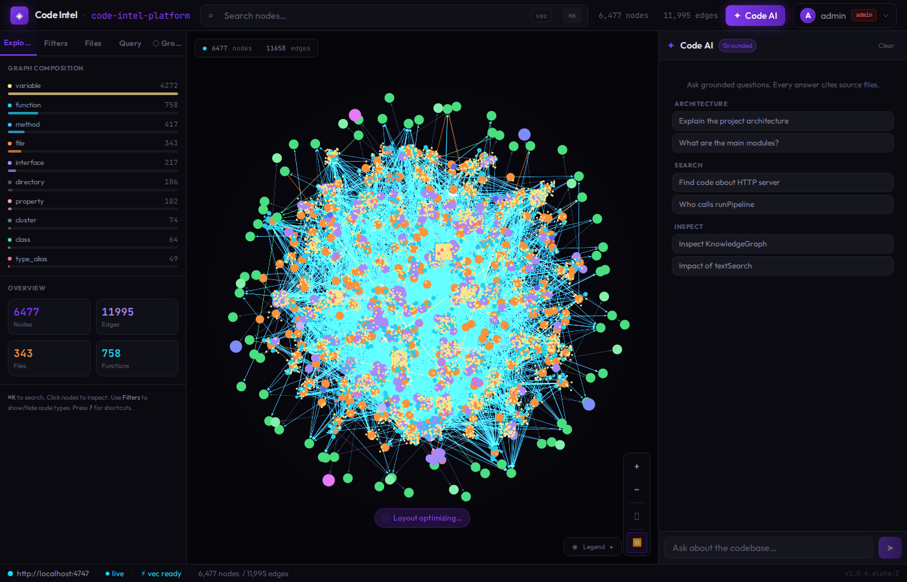

# Code Intelligence Platform

[](https://www.npmjs.com/package/@vohongtho.infotech/code-intel)

A static code analysis platform that builds a **Knowledge Graph** from your source code and makes it explorable through a Web UI, HTTP API, CLI, and MCP server.



---

## ✨ Features

- **Knowledge Graph** — parses 15 languages into nodes (functions, classes, files, etc.) and edges (calls, imports, extends, implements, handles, and framework-derived relationships)
- **Force-directed Graph Explorer** — interactive Sigma.js visualization with color-coded node types, hover highlighting, and filters
- **Graph Query Language (GQL)** — query your codebase with `FIND`, `TRAVERSE`, `PATH`, `COUNT GROUP BY`; CLI, HTTP API, and MCP tool
- **Source Code Preview** — click any node to open syntax-highlighted source at the exact line; "Open in editor" (`vscode://`) button
- **Query Console** — web UI panel with GQL editor, sortable results table, query history, example queries, aggregate-safe rendering, and panel-scoped error containment
- **AI-Generated Symbol Summaries** — optional `--summarize` flag generates 1-2 sentence summaries per symbol via OpenAI, Anthropic, or Ollama; cached by code hash
- **Hybrid Search (BM25 + Vector RRF)** — Reciprocal Rank Fusion with truthful `requestedMode`, `actualMode`, and `searchMode`. Fallback reports `VECTOR_INDEX_UNAVAILABLE` for missing/unbuilt/empty vector state and `VECTOR_QUERY_FAILED` for vector execution errors.
- **Semantic Vector Search** — embeddings via backend-authoritative model catalog; default `Xenova/all-MiniLM-L6-v2`; enriched with summaries when available. `code-intel serve` treats published vector artifacts as read-only: missing, stale, incompatible, or corrupt vectors degrade to BM25 and report guidance to run `code-intel analyze --embeddings` instead of rebuilding in place.
- **Code AI Chat** — grounded assistant that cites source files in every answer
- **File Watcher & Auto-Reindex** — `code-intel watch` detects file saves and patches the live graph within ~1 second; WebSocket push notifies connected clients
- **Code Health** — `code-intel health` reports dead code, circular dependencies (Tarjan SCC), god nodes, orphan files, and a 0–100 health score
- **HTTP API** — REST endpoints for graph, search, inspect, blast radius, flows, query, source, health
- **MCP Server** — Model Context Protocol integration for LLM tooling with 6 new reasoning tools (`explain_relationship`, `pr_impact`, `similar_symbols`, `health_report`, `suggest_tests`, `cluster_summary`), pagination, tool-chaining hints, and fail-closed scoped-search validation for malformed explicit repo/group selectors. _(v1.0.10)_ Canonical scope selectors (`scope.repoId` and flat `repoId`) now enforce stable-ID-only resolution without fallback to name/path matching; legacy `repo` selector preserves compatibility resolution. Explicit MCP `search` scope now resolves before ambient-repository preload, while unscoped MCP `search` preserves the existing default-repository behavior.
- **Security & Quality Scanning** — `code-intel secrets` (hardcoded API keys, DB URLs, RSA keys), `code-intel scan` (SQL Injection CWE-89, XSS CWE-79, SSRF CWE-918, Path Traversal CWE-22, Command Injection CWE-78), `--format sarif` for CI integration
- **Complexity Metrics** — `code-intel complexity --top N` ranks functions by cyclomatic + cognitive complexity; `complexity_hotspots` MCP tool
- **Test Coverage Gaps** — `code-intel coverage` lists untested exported symbols sorted by blast radius; `--threshold <pct>` fails CI if below target
- **Deprecated API Detection** — `code-intel deprecated` finds usages of `@deprecated` JSDoc, `@Deprecated` (Java), `#[deprecated]` (Rust), and built-in Node.js deprecated APIs
- **CLI** — analyze, serve, watch, query, search, inspect, impact, health commands with animated `█░` progress bars and braille spinners
- **Multi-language** — TypeScript, JavaScript, Python, Java, Go, C, C++, C#, Rust, PHP, Ruby, Swift, Kotlin, Dart, HTML (15 languages via tree-sitter AST)
- **Truthful capability states** — language capability reporting distinguishes `supported`, `partial`, `not-applicable`, and `unsupported` so grammar availability is not mistaken for semantic completeness
- **Framework Semantic Adapters** _(v1.0.11)_ — auto-detects framework registrations and emits static route, handler, DI, resource, prompt, form, and embedded-script facts for NestJS, Express, Fastify, ASP.NET Core, Microsoft DI, Spring, FastAPI, Flask, Django, Go HTTP routers, Laravel, Symfony, Rails, MCP SDK, and HTML.
- **Evidence-Carrying Relationships** _(v1.0.11)_ — framework-derived and semantic-resolution graph edges now persist explicit trust metadata (`certainty`, `strategy`, `resolverVersion`, `evidenceRef`) and `explain_relationship` can return evidence-backed coverage/boundary detail instead of relying on naming conventions alone.
- **Framework Fingerprint Metadata** _(v1.0.11)_ — published index metadata records detected frameworks and a framework fingerprint so trust checks can distinguish stale framework-semantic state from corrupt artifacts.
- **Graph-Aware API Contracts** _(v1.0.11)_ — normalized HTTP producer/consumer contract facts layered on top of route discovery: request/response shapes, a method+normalized-path matcher linking consumers to routes, and a compatibility engine flagging breaking changes (removed routes, changed methods, added required fields, removed/retyped response fields) between two indexed repositories. `api_contract`, `api_impact`, and `api_drift` MCP tools, matching HTTP routes, and `code-intel api-contract` / `api-impact` / `api-drift` CLI commands.
  - Producer support: Express, Fastify, NestJS, ASP.NET Core. Consumer support: `fetch`, Axios, Angular `HttpClient`. Other route-discovery frameworks are unaffected and do not yet emit contract facts.
  - Never fabricates a link or a "safe" verdict — ambiguous matches, dynamic URLs, and unresolved shapes surface as `candidate-set`/`unresolved` certainty and incomplete coverage instead of guessing.
  - `group sync` uses the same matcher to resolve cross-repo route↔consumer links instead of name/substring equality.
- **Branch-Aware Semantic Graph Diff** _(v1.0.11)_ — compares the semantic graph between two Git refs (branches, tags, or commits) instead of only mapping textual hunks onto one graph state: added/removed/changed/moved/renamed symbols, relationship and call-site certainty changes, and API-contract deltas. Each ref is analyzed independently in an isolated temporary `git worktree` checkout — never touching your working tree, HEAD, or the currently published index — and cached per (ref, analyzer version) under `.code-intel/snapshots/`. `code-intel graph diff --base <ref> --head <ref>`, a `graph_diff` MCP tool, `POST /api/v1/graph/diff` HTTP route, and an optional `analysisMode: "semantic-snapshot"` on `pr_impact` that adds the semantic diff alongside (never in place of) its existing textual-hunk blast radius.
  - Rename/move detection is conservative: a symbol is only reported as `renamed`/`moved` when its declaration content is byte-identical across an unambiguous one-to-one pairing (optionally corroborated by Git's own rename detection); a shared display name alone is never treated as proof. Ambiguous candidates (e.g. identical-body overloads) are left as separate added/removed deltas annotated with candidate correlation metadata, never merged.
  - Coverage is always reported: a failed or unsupported ref never silently degrades to "no semantic impact" — `coverage.complete` and `coverage.incompleteReasons` (or, for `pr_impact`, `baseSnapshot`/`headSnapshot` boundaries) say why when a diff can't be produced or is partial.
  - Flow and cluster deltas are not yet supported — their current node identity is a per-analysis-run enumeration index rather than a content fingerprint, so it isn't guaranteed stable across independent runs; the diff reports this explicitly (`flows`/`clusters: { supported: false, reason }`) instead of fabricating deltas.
- **Correctness-First Incremental Analysis** _(v1.0.8)_ — detects committed, staged, unstaged, untracked, mtime-changed, and deleted files. Zero-change runs keep the fast path; any non-empty change set performs a clean full graph rebuild so cross-file `calls`, `imports`, `extends`, `implements`, clusters, and flows cannot be lost.
- **Parallel Analysis** — `--parallel` flag runs parse + resolve phases on worker threads for large repos
- **Selection-aware AI Context Files** — the first interactive `code-intel analyze` stores the selected agents in `.code-intel/agent-targets.json`; later analyses update only those selected repository instruction files, such as `AGENTS.md`, `CLAUDE.md`, `.github/copilot-instructions.md`, `.cursor/rules/code-intel.mdc`, `.kiro/steering/code-intel.md`, `.clinerules`, `.windsurfrules`, `.kilocode/rules/code-intel-rules.md`, or `.agents/rules/code-intel-rules.md`
- **Agent-aware Setup** _(v1.0.10)_ — `code-intel setup [path]` reads `.code-intel/agent-targets.json`, configures MCP independently for the resolved selected repository root, and installs only supported global hooks/plugins for agents selected during analysis. Setup never creates repository-scoped `.cursor`, `.github`, `.kilocode`, `.agents`, `.clinerules`, `.windsurfrules`, `AGENTS.md`, or similar instruction files
- **Repository Groups** — multi-repo / monorepo service tracking with workspace auto-discovery (npm, pnpm, Nx, Turborepo), contract extraction (OpenAPI, GraphQL, Protobuf), type-aware similarity scoring, and cross-repo dependency detection
  - **OpenAPI note:** contract extraction currently parses **JSON** OpenAPI/Swagger specs. YAML filenames are discovered, but YAML parsing is not implemented in `v1.0.4`.
- **Cross-Repository Contract Drift** _(v1.0.11)_ — `group_contract_drift` upgrades a synchronized repository group from discovery/linking into semantic compatibility analysis: compares HTTP routes, shared schemas, and events across a base/head Git ref pair (or explicit per-repo snapshot IDs) and classifies each change `compatible` / `potentially-breaking` / `breaking` / `unknown`, naming the affected consumer repository and source when evidence is exact.
  - Example: `code-intel query` isn't used here — call the MCP tool directly, e.g. `group_contract_drift { "name": "platform", "base_ref": "main", "head_ref": "HEAD" }`, or `GET /api/v1/groups/platform/drift?base_ref=main&head_ref=HEAD`.
  - **Known-consumer scope, not the runtime universe:** results are scoped to repos in the synchronized group. No known in-scope consumer is reported as exactly that — never as "proven unused" — since an unsynchronized or out-of-group consumer is real but invisible to this analysis.
  - **Supported in 1.0.11:** HTTP route/shape changes (delegates to the same rules as `api_drift`), shared schema property/type/requiredness/enum changes, and event topic/payload-shape changes where statically modeled. GraphQL and protobuf/gRPC contracts are extracted but always report `unknown` — extension points only, not yet implemented.
  - Contract drift integrates additively into `pr_impact`: when the active repo belongs to a synchronized group, `analysisMode: "semantic-snapshot"` folds a `crossRepositoryContracts` section into the existing local blast radius; a failure to load group drift degrades that section's coverage rather than corrupting the local result.
  - Incremental: `group_sync` records which contract fingerprints changed since the previous sync (`changedContractIds`); within one `group_contract_drift` call, a contract whose base/head fingerprint is provably identical skips the deep comparator rather than recomputing a guaranteed-empty result. Group-wide full comparison is always the fallback — there is no separate incremental link-matching engine to fall back *from*.
- **Multi-Layer Exclusion System** — exclude files and folders from analysis with `.codeintelignore` (team, tracked), `.codeintelignore.local` (personal, gitignored), or CLI flags `--skip-folders` / `--skip-files` (per-run); supports basename matching (`tests`), path matching (`src/legacy`), and glob patterns (`**/*.generated.ts`)
- **Structured Logging** — winston-based logger with daily-rotating log files at `~/.code-intel/logs/`, sensitive-data masking, and configurable log levels
- **Performance** — parallel batch file I/O, shared file cache (zero double-reads), O(log n) binary-search enclosing-function lookup
- **`code-intel init` Wizard** _(v0.9)_ — interactive 5-step setup wizard; creates `~/.code-intel/config.json` with editor MCP registration, LLM provider, embeddings, auth mode, and port settings
- **Config Management CLI** _(v0.9)_ — `config get/set/list/validate/reset` with JSON Schema, `$ENV_VAR` expansion, and masked secret output
- **Better Error Messages** _(v0.9)_ — `CI-XXXX` error codes, actionable hints, `--debug` stack traces, startup prerequisite checks
- **Shell Completion** _(v0.9)_ — `code-intel completion bash|zsh|fish`; dynamic repo + group name completion; `setup --completion` auto-installs
- **VS Code Extension** _(v0.9)_ — symbol hover tooltips, Symbol Explorer panel, status bar freshness indicator, "Open in Graph" command, command palette integration
- **Self-Update** _(v0.9)_ — `code-intel update` checks npm registry; background version check on startup; `--no-update-check` to suppress
- **Self-contained Runtime Lifecycle** _(v1.0.11)_ — bundled install, `doctor --json`, side-by-side `upgrade`, `version list`, `version pin`, schema-safe `rollback`, default data-preserving `uninstall`, per-target checksum/SBOM/provenance artifacts
- **`--dry-run` flag** _(v0.9)_ — `analyze`, `clean`, `group sync` preview what would happen without side effects
- **`code-intel doctor`** _(v0.9)_ — full diagnostics: Node.js, git, config, registry, DB integrity, network; exit 1 on any failure
- **Lazy Graph Loading** _(v1.0)_ — `serve` starts in <2s for 10k-file repos; LRU node cache (5,000 nodes by default, `GRAPH_CACHE_SIZE` env var); background warm of high-blast-radius nodes
- **Pre-Built BM25 Index** _(v1.0)_ — inverted index built at analysis time; loaded into memory on `serve` startup; 2,000+ q/s throughput; incremental-only updates on re-index; LRU-capped hot-query cache for repeated searches
- **Memory-Efficient Graph** _(v1.0)_ — `Int32Array`-packed adjacency + symbol interning = ≥30% memory reduction; `--max-memory <MB>` flag spills node content to DB
- **Pipeline Profiling** _(v1.0)_ — `analyze --profile` writes `.code-intel/profile.json`; per-phase heap memory captured; bottleneck warning if any phase >50% of total; verbose timing table
- **Load & Soak Tests** _(v1.0)_ — nightly CI load tests (1k/10k fixture repos), weekly soak tests (memory stability, watcher throughput), regression gate: >20% regression fails CI; `tests/perf/baseline.json` committed to repo
- **Graceful Degradation** _(v1.0)_ — `X-Stale`/`X-Stale-Since` headers on DB outage; LLM-unavailable summarize skip; MCP tool timeout → `{ truncated: true }`; watcher crash recovery; worker crash retry
  - **Worker note for v1.0.4:** parallel analysis retries worker crashes, but `v1.0.4` does not introduce a new user-facing worker timeout control. Treat long/stalled analysis as runtime investigation, not documented timeout recovery behavior.
- **Token-Efficient MCP** _(v1.0.1)_ — compact JSON responses (null/undefined stripped); MCP tool defaults tuned for LLM sessions: `search`/`file_symbols`/`list_exports` default 10 results (was 50), `blast_radius`/`pr_impact` default 2 hops (was 5); `suggested_next_tools` opt-in via `CODE_INTEL_SUGGEST_NEXT_TOOLS=true`; ~63% fewer tokens per typical 5-tool session
- **Context Builder** _(v1.0.1)_ — `src/context/builder.ts` builds structured `[SUMMARY]` / `[LOGIC]` / `[RELATION]` / `[FOCUS CODE]` documents from seed symbols in ≤50% of v1.0.0 token cost; query-intent presets (`code`, `callers`, `architecture`, `auto`); adaptive snippets; cross-block dedup; `code-intel context <symbols...> --show-context`
- **Enforced Tool Policy in AI Context Files** _(v1.0.1)_ — `AGENTS.md`/`CLAUDE.md`/`copilot-instructions.md`/`.cursor/rules`/`.kiro/steering` now include a `TOOL POLICY: ENFORCED` block forbidding raw `grep`/`find`/`cat` in favour of `code-intel search` → `inspect` → `impact`; saves ~3,000 tokens per cold-file lookup

---

## 🚀 Quick Start

### Requirements

- **Node.js** 22.17+
- **npm** 10+

---

### Option A — Self-contained runtime install _(no system Node/npm required)_

Supported self-contained targets:
- linux-x64
- linux-arm64
- darwin-x64
- darwin-arm64

Install root defaults to `~/.local/share/code-intel`.
User data stays in `~/.code-intel`.

```bash
node scripts/distribution/install/install-runtime.mjs \
  --archive code-intel-runtime-v1.0.11-linux-x64.tar.gz \
  --checksum-file code-intel-runtime-v1.0.11-linux-x64.tar.gz.sha256
```

Verify:

```bash
~/.local/share/code-intel/bin/code-intel --version
~/.local/share/code-intel/bin/code-intel doctor --json
```

Lifecycle:

```bash
code-intel version list --json
code-intel upgrade --archive ./code-intel-runtime-v1.0.11-linux-x64.tar.gz --checksum-file ./code-intel-runtime-v1.0.11-linux-x64.tar.gz.sha256 --version 1.0.11
code-intel version pin 1.0.11
code-intel rollback 1.0.10
code-intel uninstall --dry-run
code-intel uninstall
```

`rollback` fails if the selected runtime declares an older index schema than current persisted data. Re-run `code-intel analyze` after rollback when prompted.

### Option B — Install globally from npm _(developer / npm workflow)_

```bash
npm install -g @vohongtho.infotech/code-intel
```

> **Default secret storage:** the CLI stores secrets in the encrypted `.code-intel/.secrets` file backend. No OS keychain package is required for the default install.
>
> **Upgrade note for v1.0.8:** Run a forced analysis once after upgrading to publish the atomic generation layout and refresh all graph-derived relationships:
>
> ```bash
> code-intel analyze --force
> ```
>
> This publishes `.code-intel/current.json` plus a trusted generation containing graph, BM25, optional vector data, and metadata. Changed/deleted source sets use a correctness-first full rebuild; only zero-change runs keep the incremental fast path.
>
> **Upgrade note for sticky embeddings:** if a repo was previously indexed with semantic search, the next `code-intel analyze` will detect legacy `vector.db` state, normalize `.code-intel/meta.json`, and keep embeddings up to date automatically. Older CLI builds may ignore the remembered preference until upgraded, but they should continue to tolerate the extra metadata fields.

Verify the installation:

```bash
code-intel --version
```

---

### Option C — Build from source

Use this if you want to develop, modify, or contribute to the platform.

**1. Clone the repository**

```bash
git clone https://github.com/vohongtho/code-intel-platform.git
cd code-intel-platform
```

**2. Install all workspace dependencies**

```bash
npm install
```

**3. Build all packages** (shared → core → web)

```bash
npm run build
```

This runs `tsup` for the core package (outputs to `code-intel/core/dist/`) and `vite` for the web UI (outputs to `code-intel/web/dist/`). The core build also copies bundled tree-sitter WASM grammars, including `tree-sitter-html.wasm`, into `code-intel/core/dist/wasm/` for packaged installs.

**4. Install the built CLI globally**

```bash
npm install -g ./code-intel/core
```

Verify:

```bash
code-intel --version
```

> **Tip:** After making code changes, re-run `npm run build` — the CLI picks up the new build automatically since the global install points to the local `dist/` folder.

---

### Option D — Build locally & install globally _(CI / automation)_

Use this approach in CI pipelines, Docker images, or any environment where you need a clean, self-contained global install from local source without a persistent `node_modules` link.

**1. Clone & install dependencies**

```bash
git clone https://github.com/vohongtho/code-intel-platform.git
cd code-intel-platform
npm install
```

**2. Build all packages**

```bash
npm run build
```

**3. Pack the core package into a tarball**

```bash
cd code-intel/core
npm pack
# produces: vohongtho.infotech-code-intel-0.1.4.tgz (version number may vary)
cd ../..
```

**4. Install the tarball globally**

```bash
npm install -g code-intel/core/vohongtho.infotech-code-intel-*.tgz
```

**5. Verify**

```bash
code-intel --version
```

#### One-liner (copy-paste for CI scripts)

```bash
git clone https://github.com/vohongtho/code-intel-platform.git && \
  cd code-intel-platform && \
  npm install && \
  npm run build && \
  npm pack --workspace=code-intel/core && \
  npm install -g vohongtho.infotech-code-intel-*.tgz
```

#### Docker example

```dockerfile
FROM node:22-bookworm-slim

RUN git clone https://github.com/vohongtho/code-intel-platform.git /opt/code-intel && \
    cd /opt/code-intel && \
    npm install && \
    npm run build && \
    npm pack --workspace=code-intel/core && \
    npm install -g vohongtho.infotech-code-intel-*.tgz && \
    rm -rf /opt/code-intel

WORKDIR /workspace
ENTRYPOINT ["code-intel"]
```

> **Why pack instead of `npm install -g ./code-intel/core`?**
> `npm pack` produces a standalone tarball containing only the published `files` (the `dist/` folder + `package.json`). This mirrors exactly what is published to npm and avoids bringing in dev symlinks or workspace hoisting artefacts.

---

### Analyze & Serve

```bash
# First, analyze the project to build the index
code-intel analyze

# Or assign a stable unique repo name
code-intel analyze ./my-project --name api-core

# Then start the server (requires an existing index)
code-intel serve

# Or with a specific path and port
code-intel analyze ./my-project
code-intel serve ./my-project --port 4747
```

### Stable repository names and IDs

Indexed repositories now have:
- a stable internal `id`
- a unique user-facing `name`
- a mutable filesystem `path`

Use names for lookup. IDs stay stable across rename and relink operations.

```bash
code-intel repo list
code-intel repo show api-core
code-intel repo rename api-core api-platform
code-intel repo relink api-platform ../new-location
```

`code-intel analyze` naming rules:
- new path + new `--name` creates a named repo entry
- existing path + same `--name` refreshes that repo
- existing path + different `--name` fails; use `code-intel repo rename`
- new path + existing `--name` fails; use `code-intel repo relink`
- **no-op analyze with missing registry entry** _(v1.0.10)_ automatically restores the entry using published metadata without creating a new generation

Legacy registries without repo IDs migrate automatically on load. If old entries share the same basename-derived name, the migration repairs duplicates deterministically and prints a warning so you can rename them later.

Then open **http://localhost:4747** in your browser — the Web UI auto-connects and loads the graph.

### Self-contained runtime troubleshooting

- `code-intel doctor --json` reports bundled runtime integrity, installed versions, uninstall inventory, parser assets, repo trust, vector state, and PATH conflicts.
- `code-intel uninstall` removes only managed launcher/runtime files by default. Repository indexes, config, logs, and agent files remain under `~/.code-intel`.
- `code-intel uninstall --purge-data --dry-run` prints the deletion inventory first.
- `code-intel uninstall --purge-data --yes` deletes data only when ownership markers match the expected Code Intel data root.
- PATH conflicts are warnings only. Move the stable launcher earlier in `PATH`.
- Missing native or WASM assets show as `fail` in doctor. Reinstall the bundle.
- Rollback across incompatible index schema is blocked. Re-run `code-intel analyze` after switching runtimes.

If no admin account exists yet, the first-run setup screen appears. The login and bootstrap forms include eye-icon password visibility toggles, and the username input placeholder reads `User Name`.

Authenticated users can open **Settings** from the profile menu in the Web UI to inspect global server configuration. Admin users can edit routed settings sections for LLM, embeddings, analysis, server, authentication, updates, and telemetry. The Embeddings Model control is a backend-driven selector populated from `GET /api/v1/embeddings/models`, not a free-text field. Unsupported legacy values render as disabled recovery options until replaced with a supported model. These settings are server-global and complement the CLI flows (`code-intel init` and `code-intel config *`) rather than replacing editor/MCP setup.

### After analysis

`code-intel analyze` automatically generates or updates:
- **`AGENTS.md`** + **`CLAUDE.md`** — AI context files with a concise `code-intel` guidance block. These files are managed with **surgical precision**:
  - **File does not exist** → created from a template with a managed block and a clearly marked section for your own notes
  - **File exists with markers** → only the `<!-- code-intel:start -->…<!-- code-intel:end -->` block is updated; all your custom content is preserved untouched
  - **File exists without markers** → the block is appended at the end; existing content is never overwritten

### Exclude files and folders from analysis

Code-intel provides a **multi-layer exclusion system** for fine-grained control over what gets analyzed:

#### 1. `.codeintelignore` (team-level, tracked)

Create a `.codeintelignore` file in your project root for team-wide exclusions:

```
# Exclude specific folders
vendor
generated
fixtures

# Exclude specific files
config.generated.ts
schema.proto.ts

# Exclude by pattern (glob)
*.min.js
**/*.test.ts
src/legacy/**
```

**Pattern types:**
- **Basename match**: `tests` → matches any file or folder named "tests" anywhere
- **Path match**: `src/legacy` → matches only that specific path from workspace root
- **Glob match**: `**/*.generated.ts` → matches all generated TypeScript files at any depth

#### 2. `.codeintelignore.local` (personal preferences, gitignored)

Create a `.codeintelignore.local` file for personal exclusions that won't be committed:

```
# My personal preferences (not tracked in git)
examples
docs
tutorials
```

This file is automatically added to `.gitignore` when you run `code-intel analyze`.

#### 3. CLI flags (one-off exclusions)

For temporary or experimental exclusions, use CLI flags:

```bash
# Exclude specific folders for this run only
code-intel analyze --skip-folders tests,examples

# Exclude files by pattern
code-intel analyze --skip-files "*.generated.ts,*.proto.ts"

# Combine multiple exclusions
code-intel analyze --skip-folders src/legacy --skip-files config.gen.ts

# Repeatable flags (alternative syntax)
code-intel analyze --skip-folders tests --skip-folders examples
```

**All layers combine additively** — an entry excluded by any layer is excluded from analysis.

---

## 🤖 MCP and agent setup

Repository instruction files are selected and generated by `code-intel analyze`. On the first interactive analysis, the selected agents are stored in:

```text
.code-intel/agent-targets.json
```

Run setup for that repository:

```bash
code-intel analyze && code-intel setup [path]
```

Setup performs two independent operations:

1. **MCP configuration** — configures/displays the Code Intel MCP server entry.
2. **Selected global integrations** — installs only the supported global hook or plugin integrations mapped to agents saved by analysis.

Setup does **not** create or modify repository instruction files such as `.cursor/**`, `.github/**`, `.kilocode/**`, `.agents/**`, `.clinerules`, `.windsurfrules`, `AGENTS.md`, or `CLAUDE.md`. Existing files are left unchanged.

Useful modes:

```bash
code-intel setup ./services/api     # Use that repository's saved selection
code-intel setup --mcp-only         # Configure MCP only
code-intel setup --all-agents       # Install all supported global integrations
code-intel setup --dry-run          # Show the plan without writing files
```

When the selection file is missing or invalid, agent integration installation fails closed and never falls back to every agent. Run `code-intel analyze` to create the repository selection, then rerun setup. MCP can connect before a repository is indexed; graph-backed MCP tools will instruct you to run `code-intel analyze`, then retry without reconnecting.

> The `code-intel-hook` binary can rewrite supported shell lookups such as `grep MyClass src/` into structured Code Intel searches. Installers remain idempotent and preserve existing user configuration.

---

## 🖥️ Web UI

| Panel | Description |
|-------|-------------|
| **Explorer** | Graph composition stats, search results, overview counters |
| **Filters** | Toggle node/edge types, set focus depth |
| **Files** | Recursive file tree with search filter and file icons |
| **Group** | Multi-repo group view with contracts and cross-repo links (visible when in group mode) |
| **Graph Canvas** | Force-directed graph, click nodes to inspect, hover to highlight neighbors |
| **Code AI** | Chat with grounded answers citing source file locations |
| **Settings** | Routed global server configuration screen under the profile menu; admin-editable sections for LLM, embeddings, analysis, server, authentication, updates, and telemetry |

### Settings

- Open **Settings** from the profile menu in the top-right header, above **Sign out**.
- Settings routes use `/settings/:section` with browser back/forward support instead of `#fragment` anchors.
- Settings are **server-global** for the connected code-intel instance, not per-user preferences.
- Authenticated viewers can inspect masked config values; admins can save edits.
- `code-intel init` and `code-intel config *` remain the CLI source for first-run setup and editor/MCP registration. The Web UI settings screen complements those commands; it does not replace editor/MCP setup in v1.

### Search Modes

- **Keyword** (default) — BM25-like text search across node names and content
- **⚡ vec** — Semantic vector search using embeddings (auto-built in background after server starts)

Toggle between modes using the `vec` button in the header search bar.

---

## 📦 Architecture

```
code-intel-platform/
├── code-intel/
│   ├── shared/                    # Shared types published alongside core
│   │   └── src/
│   │       ├── graph-types.ts     # CodeNode, CodeEdge, NodeKind, EdgeKind
│   │       ├── languages.ts       # Language enum (14 languages)
│   │       ├── pipeline-types.ts  # PipelineContext, PhaseResult
│   │       └── detection.ts       # Language detection helpers
│   │
│   ├── core/                      # Backend: pipeline, parsers, HTTP API, MCP, CLI, storage
│   │   └── src/
│   │       ├── pipeline/          # 6-phase DAG orchestrator + DAG validator
│   │       │   └── phases/        # scan · structure · parse · resolve · cluster · flow
│   │       │
│   │       ├── parsing/           # Tree-sitter AST parsing layer
│   │       │   ├── parser-manager.ts   # Loads + caches tree-sitter parsers
│   │       │   ├── ast-cache.ts        # AST memoization
│   │       │   ├── query-runner.ts     # Executes tree-sitter queries
│   │       │   └── queries/            # Per-language query files (14 languages)
│   │       │
│   │       ├── languages/         # Language registry + per-language extraction modules
│   │       │   ├── registry.ts         # Maps file extension → language module
│   │       │   └── modules/            # ts · js · py · java · go · rs · c · cpp · cs
│   │       │                           # php · kt · rb · swift · dart
│   │       │
│   │       ├── resolver/          # Import resolution (edges between files/symbols)
│   │       │   ├── import-resolver.ts
│   │       │   ├── binding-tracker.ts
│   │       │   └── strategies/    # relative-path · package-lookup · namespace-alias · wildcard-expand
│   │       │
│   │       ├── call-graph/        # Call edge builder + call classifier
│   │       ├── inheritance/       # Heritage builder, MRO walker, override detector
│   │       ├── scope-analysis/    # Scope builder (variable / binding scope trees)
│   │       ├── clustering/        # Directory-based community detection
│   │       ├── flow-detection/    # Entry-point finder + execution flow tracer
│   │       │
│   │       ├── graph/             # In-memory knowledge graph (O(1) node/edge lookup)
│   │       ├── search/            # BM25 text search · vector embedder · vector index (LadybugDB)
│   │       ├── storage/           # LadybugDB graph persistence · repo registry · metadata
│   │       │
│   │       ├── multi-repo/        # Repository groups, contract extraction, cross-repo linking
│   │       │   ├── group-registry.ts   # Load/save group configs + sync results
│   │       │   ├── group-sync.ts       # Extract contracts + match via RRF
│   │       │   ├── group-query.ts      # Cross-repo BM25 search with RRF merge
│   │       │   └── types.ts            # RepoGroup, Contract, ContractLink, GroupSyncResult
│   │       │
│   │       ├── http/              # Express REST API + static web UI serving
│   │       ├── mcp-server/        # MCP stdio transport + all tool/resource handlers
│   │       ├── shared/            # Logger (winston, sensitive-data masking, ~/.code-intel/logs/)
│   │       └── cli/               # Commander CLI (progress bars, spinners)
│   │           ├── main.ts              # All CLI commands
│   │           └── context-writer.ts    # Upserts AGENTS.md + CLAUDE.md blocks
│   │
│   └── web/                       # React + Sigma.js frontend
│       └── src/
│           ├── pages/             # ConnectPage · LoadingPage · ExplorerPage
│           ├── components/
│           │   ├── graph/         # GraphView (Sigma.js force-directed canvas)
│           │   ├── panels/        # NodeDetail · SearchBar · SidebarChat · SidebarFiles · SidebarFilters
│           │   └── shared/        # Header · StatusFooter · KeyboardShortcutsModal
│           ├── ai/                # Chat agent with intent parsing + tool calls
│           ├── api/               # ApiClient (search, vector-search, inspect, blast-radius, flows, clusters)
│           ├── graph/             # Node color palette + ForceAtlas2 layout utilities
│           └── state/             # React context + reducer (AppContext, AppState)
│
├── .code-intel/                   # Generated per-repo: graph.db · vector.db · meta.json
└── .codeintelignore               # Optional: directories to exclude (like .gitignore)
```

### Pipeline Phases

| Phase | Description |
|-------|-------------|
| `scan` | Walk filesystem, collect source files (parallel batch I/O, 512 KB limit), ignore `node_modules`, `dist`, `.venv`, etc. |
| `structure` | Create file and directory nodes in the graph |
| `parse` | Read files in parallel batches of 64, extract symbols (functions, classes, etc.), build per-file sorted function index |
| `resolve` | Resolve imports → edges, build call graph (O(log n) binary-search lookup), detect heritage (extends/implements) |
| `cluster` | Directory-based community detection, add cluster nodes |
| `flow` | Detect entry points, trace execution flows |
| `summarize` | _(opt-in)_ Generate 1–2 sentence AI summaries for `function`/`class`/`method`/`interface` nodes via OpenAI, Anthropic, or Ollama; skips unchanged nodes (code-hash cache) |

Each phase streams live progress to the CLI via animated `█░` progress bars:

```
  [parse    ] ████████████████░░░░░░░░░░░░░░  53% (80/151)
```

Post-pipeline steps (DB persist, context files) show a braille spinner:

```
  ⠹ Persisting graph to DB…
```

---

## 📋 Logging

Logs are written to **`~/.code-intel/logs/`** using daily rotation (powered by [winston](https://github.com/winstonjs/winston)):

| Setting | Default | Override |
|---------|---------|----------|
| Log directory | `~/.code-intel/logs/` | — |
| Log file pattern | `YYYY-MM-DD-code-intel.log` | — |
| Max file size | 20 MB | — |
| Retention | 14 days | — |
| Log level | `info` | `LOG_LEVEL=debug\|info\|warn\|error\|silent` |
| Production mode | Console only | `NODE_ENV=production` |

Sensitive data (passwords, tokens, API keys, emails, credit cards, etc.) is automatically **masked** before writing — only the first and last character are visible.

---

## 🛠️ CLI Commands

### Setup

```bash
code-intel analyze && code-intel setup [path]   # Canonical first run for MCP-enabled repos
code-intel setup [path]                         # Configure MCP and selected-agent global integrations
code-intel setup --mcp-only                     # Configure MCP without agent integrations
code-intel setup --all-agents                   # Install every supported global integration
code-intel setup --dry-run                      # Print the plan without writing files
```

Project instruction files are generated only by `code-intel analyze` from the saved repository agent selection.

### Analyze

```bash
code-intel analyze [path]                # Parse source code and auto-use incremental mode when prior metadata makes it safe
code-intel analyze --force               # Discard existing index and perform a full re-analysis
code-intel analyze --embeddings          # Build a vector index and remember embeddings for this repo
code-intel analyze --skip-embeddings     # Skip embedding generation for this run only
code-intel analyze --skip-agents-md      # Preserve any hand-edited content in AGENTS.md / CLAUDE.md
```

Sticky embeddings behavior:

- The first successful `code-intel analyze --embeddings` run stores the repo preference in `.code-intel/meta.json`.
- Later `code-intel analyze`, `code-intel analyze --incremental`, and `code-intel analyze --force` runs auto-enable embeddings for that repo unless you pass `--skip-embeddings`.
- Plain `code-intel analyze` now auto-attempts incremental graph reindexing when valid prior `.code-intel/meta.json` exists and incremental safety checks pass; otherwise it falls back to full analysis.
- If `vector.db` is missing, stale, corrupted, or incompatible with the current embedding fingerprint, `code-intel analyze` rebuilds the full vector index automatically.
- `--skip-embeddings` does not forget the repo preference; it skips vectors for that run and marks remembered embeddings stale until the next normal analyze.
- Previously indexed repos with only a legacy `vector.db` upgrade in place on the next analyze; no manual migration command is required.

```bash
code-intel analyze --skip-git            # Allow analysis of directories that are not Git repositories
code-intel analyze --verbose             # Print every file skipped due to an unsupported parser
```

### Server

```bash
code-intel mcp [path]                    # Launch the MCP stdio server consumed by AI-enabled editors
code-intel serve [path] --port <n>       # Start the HTTP API and serve the interactive web UI (default :4747)
code-intel watch [path] --port <n>       # Start HTTP server + file watcher (auto-reindex on file saves)
```

### Query (GQL)

```bash
code-intel query "<gql>"                 # Run a GQL query (FIND / TRAVERSE / PATH / COUNT GROUP BY)
code-intel query "<gql>" --format table|json|csv   # Output format (default: table)
code-intel query --file <path.gql>       # Load query from file
code-intel query "<gql>" --limit <n>     # Override LIMIT in the query
code-intel query --save <name> "<gql>"   # Save a named query to .code-intel/queries/
code-intel query --run <name>            # Run a saved query by name
code-intel query --list                  # List all saved queries
code-intel query --delete <name>         # Delete a saved query
```

### Health

```bash
code-intel health [path]                 # Show health score + dead code / cycles / god nodes / orphans
code-intel health --dead-code            # List all dead-code symbols
code-intel health --cycles               # List all circular dependency cycles
code-intel health --orphans              # List all orphan files
code-intel health --json                 # Machine-readable JSON output
```

### Registry

```bash
code-intel list                          # Display all repositories that have been indexed
code-intel status [path]                 # Report index freshness, symbol counts, and last-run duration
code-intel clean [path]                  # Remove the .code-intel/ index for the specified repository
code-intel clean --all --force           # Permanently remove all indexed repositories (requires --force)
```

### Exploration

```bash
code-intel search <query>                # Execute intent-aware symbol search
code-intel search <query> --limit <n>    # Limit number of results (default: 20)
code-intel search <query> --json         # Include machine-readable qualified selectors
code-intel inspect <symbol>              # Inspect a unique symbol; lists candidates when ambiguous
code-intel inspect <selector>            # Inspect an exact qualified result from search/inspect
code-intel inspect <symbol> --json       # Structured result; ambiguity exits with status 2
code-intel impact <symbol-or-selector>   # Compute the transitive blast radius of a selected symbol
code-intel impact <symbol> --depth <n>   # Set maximum traversal depth / hops (default: 5)
```

Qualified selectors use `<kind>:<percent-encoded-name>@<path>[:line]`; path separators remain readable. Copy selectors from command output; for example:

```bash
code-intel search "how to login portal"
code-intel inspect "login"               # Ambiguous names print ranked selectors
code-intel inspect "method:login@code-intel/web/src/api/client.ts:84"
code-intel impact "method:login@code-intel/web/src/api/client.ts:84"

# Relevance/performance regression check (from code-intel/core)
npm run build && node tests/perf/search-relevance-bench.mjs
```

The benchmark uses 10,003 symbols. Budgets: cold search `<250ms`; warm cached search `<25ms`.

### Semantic graph diff

```bash
code-intel graph diff --base <ref> --head <ref>       # Compare the semantic graph between two Git refs
code-intel graph diff --base main --head HEAD --json  # Full machine-readable diff
code-intel graph diff --base v1.2.0 --head v1.3.0 --no-contracts  # Skip API-contract delta computation
code-intel graph diff --base main --head HEAD --no-cache          # Force a full rebuild of both snapshots
```

Each ref is analyzed independently in an isolated temporary `git worktree` — your working tree, index, HEAD, and this repository's currently published index are never touched, on success or failure. Results are cached under `.code-intel/snapshots/`, keyed by (ref, analyzer version); a repeated diff against an unchanged ref is served from cache. See the Features section above for what is and isn't diffed (flow/cluster deltas are not yet supported).

### Groups (multi-repo / monorepo service tracking)

```bash
code-intel group create <name>                                              # Create a named group to track multiple repositories together
code-intel group add <group> <groupPath> <registryName>                    # Enroll an indexed repo in a group under the given hierarchy path
code-intel group remove <group> <groupPath>                                # Remove a repository from a group by its hierarchy path
code-intel group list [name]                                               # List all groups, or print the full membership of one group
code-intel group sync <name>                                               # Extract cross-repo contracts and resolve provider/consumer links
code-intel group contracts <name> [--kind] [--repo] [--min-confidence]    # Inspect extracted contracts and confidence-ranked cross-links
code-intel group query <name> <q>                                          # Run a merged RRF search across every repository in a group
code-intel group status <name>                                             # Audit index freshness and sync staleness for all group members
```

**`group add` parameters:**
- `<group>` — name of the group
- `<groupPath>` — hierarchy path (e.g. `hr/hiring/backend`)
- `<registryName>` — the repo's name as shown by `code-intel list`

**`group contracts` options:**
- `--kind <kind>` — filter by contract kind: `export` | `route` | `schema` | `event`
- `--repo <repo>` — filter by registry name
- `--min-confidence <pct>` — minimum link confidence 0–100 (default: 0)

---

## 🌐 HTTP API

| Method | Endpoint | Description |
|--------|----------|-------------|
| `GET`  | `/api/v1/health` | Server status, graph size, watcher state |
| `GET`  | `/api/v1/repos` | List indexed repos |
| `GET`  | `/api/v1/graph/:repoId` | Full graph (nodes + edges) |
| `POST` | `/api/v1/search` | Canonical scoped search (`query`, `limit`, `mode`, `scope`) with repo/group targeting; repo scope uses `repoId` |
| `POST` | `/api/v1/vector-search` | Deprecated compatibility alias for vector mode; returns resolved scope/mode metadata |
| `GET`  | `/api/v1/vector-status` | Vector index ready/building status |
| `GET`  | `/api/v1/nodes/:id` | Node detail (callers, callees, imports, etc.) |
| `POST` | `/api/v1/blast-radius` | Impact analysis; request body accepts canonical `repoId` |
| `POST` | `/api/v1/query` | Execute a GQL query string; accepts optional canonical `scope`, returns normalized `{ kind, nodes, edges, groups, path, executionTimeMs, truncated, totalCount, scope }` |
| `POST` | `/api/v1/query/explain` | Return query plan without executing; accepts optional canonical `scope` |
| `GET`  | `/api/v1/source` | Fetch file content with ±20 lines context; path-traversal protected; accepts optional `repoId` |
| `POST` | `/api/v1/grep` | Regex search in file content |
| `GET`  | `/api/v1/flows` | List detected flows; accepts optional `repoId` |
| `GET`  | `/api/v1/clusters` | List clusters; accepts optional `repoId` |
| `POST` | `/api/v1/graph/diff` | Semantic graph diff between two Git refs (`base_ref`, `head_ref`, optional `repoId`); paginated `nodes`/`relationships`. Requires the `analyst` role. |

Migration note: internal/UI-owned repo selectors now use `repoId`. Legacy flat `repo` inputs remain only as bounded compatibility adapters on selected surfaces during migration.

---

## 🤖 MCP Server Tools

All tools are available to any MCP-capable editor (Claude Desktop, Claude Code, VS Code, Cursor, etc.) after running `code-intel setup`.

### Core Tools

| Tool | Input | Description |
|------|-------|-------------|
| `repos` | _(none)_ | List all indexed repositories with path, indexedAt, and node/edge counts |
| `overview` | _(none)_ | Repository summary: total nodes/edges + full breakdown by kind. **Use this first** to understand the codebase shape. |
| `search` | `query` (string), `limit` (number, default 10), `mode` (`auto`\|`bm25`\|`vector`, default `auto`), `scope` (object, optional), legacy `repo`/`group` during migration | Scoped search with MCP default behavior matching HTTP: hybrid/semantic when vector is ready, BM25 otherwise; explicit `mode` can force BM25 or prefer vector with BM25 fallback |
| `inspect` | `symbol_name` (string) | 360° view of a symbol: definition, callers, callees, imports, heritage (extends/implements), members, cluster, and source preview |
| `context` | `symbols` (string[]), `intent` (`code`\|`callers`\|`architecture`\|`auto`, default `auto`), `max_tokens` (number, default/server max 6000), `limit` (number, default 10) | Token-budgeted deep context for one or more symbols: returns `summary`, `logic`, `relation`, `focusCode`, and `truncated` from the shared context builder; change-context surfaces preserve additive trust summaries when impact/test evidence is incomplete |
| `blast_radius` | `target` (string), `direction` (`callers`\|`callees`\|`both`), `max_hops` (number, default 2) | Impact analysis: traverse the call/import graph to find all affected symbols. Returns additive trust fields including `riskLevel` (`LOW` / `MEDIUM` / `HIGH` / `UNKNOWN`), `certainty`, `coverage`, and `boundaries`. |
| `file_symbols` | `file_path` (string, partial match), `limit` (number, default 10) | List all symbols defined in a file, ordered by line number. Avoids having to read raw source. |
| `find_path` | `from` (string), `to` (string), `max_hops` (number, default 8) | Find the shortest call/import path between two symbols via BFS. Additive trust fields (`certainty`, `coverage`, `boundaries`) surface when traversal is bounded or evidence-backed. |
| `list_exports` | `kind` (string, optional), `limit` (number, default 10) | List all exported symbols — the public API surface of the codebase. Filter by kind: `function`, `class`, `interface`, etc. |
| `routes` | _(none)_ | List all HTTP route handler mappings detected in the codebase |
| `clusters` | `limit` (number, default 10) | List detected code clusters (directory-based communities) with member counts and top 10 symbols each |
| `flows` | `limit` (number, default 10) | List detected execution flows with entry points, steps, and step counts |
| `query` | `gql` (string), `limit` (number, optional) | Execute a GQL query (`FIND`, `TRAVERSE`, `PATH`, `COUNT GROUP BY`) against the live graph; returns normalized `{ kind, nodes, edges, groups, path, executionTimeMs, truncated, totalCount }` |
| `detect_changes` | `base_ref` (string, default `HEAD`), `diff_text` (string, optional) | **Git-diff impact analysis**: maps changed lines to graph symbols and computes combined blast radius. Ideal for PR review or pre-commit checks. |
| `raw_query` | `cypher` (string) | _(deprecated — use `query` instead)_ Simplified Cypher-like graph query: `name='X'` or `:kind` |

### Reasoning Tools

| Tool | Input | Description |
|------|-------|-------------|
| `explain_relationship` | `from` (string), `to` (string) | Explain how two symbols are connected: directed paths, shared imports, and heritage (extends/implements). Returns up to 10 paths with at most 5 hops each plus additive trust fields such as `certainty`, `coverage`, path `strategy`, and evidence-backed `boundaries`. |
| `pr_impact` | `changedFiles` (string[]), `diff` (string, optional), `maxHops` (number, default 2), `analysisMode` (`current-graph`\|`semantic-snapshot`, default `current-graph`), `base_ref`/`head_ref` (string, required when `analysisMode` is `semantic-snapshot`) | Given changed files or a unified diff, compute full blast radius with risk scores (`HIGH` / `MEDIUM` / `LOW` / `UNKNOWN`), test coverage gaps, top files to review, and additive trust summaries when impact coverage is incomplete. `analysisMode: "semantic-snapshot"` additionally builds isolated snapshots of `base_ref`/`head_ref` and adds a full semantic graph diff alongside (never replacing) the textual-hunk blast radius. |
| `graph_diff` | `base_ref` (string), `head_ref` (string), `include_contracts` (boolean, default true), `allow_cache` (boolean, default true), `nodes_offset`/`nodes_limit`/`relationships_offset`/`relationships_limit` (number, paginated) | Compares the semantic graph between two Git refs of the active repository: added/removed/changed/moved/renamed symbols, relationship and certainty changes, and API-contract deltas. Each side is analyzed independently in an isolated temporary checkout and cached by (ref, analyzer version). Unlike `api_drift` (two already-indexed, already-registered repositories), this resolves and analyzes the refs itself. |
| `similar_symbols` | `symbol` (string), `limit` (number, default 10) | Find symbols with similar names or structure using Levenshtein distance and kind matching. Useful for finding related functions, classes, or interfaces. |
| `health_report` | `scope` (string, optional) | Code health signals for a scope: dead code, cycles, god nodes, orphan files, complexity hotspots. |
| `suggest_tests` | `symbol` (string) | Suggest test cases for a symbol: call paths, suggested cases, existing tests, untested callers, plus additive trust fields when recommendations are derived from bounded or uncertain evidence. |
| `cluster_summary` | `cluster` (string) | Rich summary of a module/cluster: purpose, key symbols, dependencies, dependents, and health score. |

### Security & Quality Tools

| Tool | Input | Description |
|------|-------|-------------|
| `deprecated_usage` | `scope` (string, optional) | Find usages of deprecated APIs (`@deprecated` JSDoc, `@Deprecated` Java, `#[deprecated]` Rust, built-in Node.js) in the codebase. |
| `complexity_hotspots` | `scope` (string, optional), `limit` (number, default 10) | Ranked list of functions/methods by cyclomatic complexity. Useful for identifying refactoring candidates. |
| `coverage_gaps` | `scope` (string, optional), `threshold` (number, optional) | Find exported symbols with no test coverage, ranked by blast radius. Useful for prioritizing test writing. |
| `secrets` | `scope` (string, optional) | Scan the knowledge graph for hardcoded secrets: API keys, passwords, tokens, private keys, high-entropy strings. |
| `vulnerability_scan` | `scope` (string, optional), `severity` (string, optional) | Scan the knowledge graph for OWASP vulnerabilities: SQL injection (CWE-89), XSS (CWE-79), SSRF (CWE-918), path traversal (CWE-22), command injection (CWE-78). |

### Group / Multi-Repo Tools

| Tool | Input | Description |
|------|-------|-------------|
| `group_list` | `name` (string, optional) | List all configured repository groups, or show full membership of one group |
| `group_sync` | `name` (string) | Extract contracts (exports, routes, schemas, events) from all member repos and detect cross-repo provider→consumer links via name matching + RRF scoring |
| `group_contracts` | `name` (string), `kind` (`export`\|`route`\|`schema`\|`event`, optional), `repo` (string, optional), `min_confidence` (number 0–1, optional) | Inspect extracted contracts and confidence-ranked cross-repo links from the last sync |
| `group_query` | `name` (string), `query` (string), `limit` (number, default 10) | Group-scoped search across all repos in a group with automatic vector/BM25 selection, deterministic RRF merge, and per-repo breakdown. |
| `group_status` | `name` (string) | Check index freshness and sync staleness for all repos in a group. Flags repos as `OK`, `STALE` (>24h), or `NOT_INDEXED`. |
| `group_contract_drift` | `name` (string), `base_ref`/`head_ref` (string) or `base_snapshot_ids`/`head_snapshot_ids` (object, per-repo), `kind` (`export`\|`route`\|`schema`\|`event`\|`graphql`\|`grpc`, optional), `repository_id` (string, optional — stable repo ID, not the mutable registry name), `limit` (number, optional), `allow_cache` (boolean, default true) | Compares synchronized group contracts across Git refs using per-repo immutable semantic snapshots. `kind`/`repository_id` narrow which contracts are compared; every member repo's state is still loaded, since other repos may still be relevant consumers. Covers HTTP routes, shared schemas, and events (GraphQL/gRPC are extension points only — not yet supported). Returns compatibility findings (`compatible`\|`potentially-breaking`\|`breaking`\|`unknown`) with certainty, coverage, and known-consumer scope; a producer change with no known in-scope consumer is reported as such, never as proven unused. `pr_impact` in `analysisMode: "semantic-snapshot"` additionally folds this in as `crossRepositoryContracts` when the active repo belongs to a synchronized group. |

### Resources

MCP resources are readable via `ReadResource` — your editor can pull them as structured context.

| URI | Description |
|-----|-------------|
| `codeintel://repo/<name>/overview` | Repository stats: total nodes, edges, and per-kind node counts |
| `codeintel://repo/<name>/clusters` | All cluster nodes with member counts |
| `codeintel://repo/<name>/flows` | All detected execution flows with entry points and steps |

---

## 💾 Storage

All generated files are stored locally — nothing is sent to external servers.

| Path | Contents |
|------|----------|
| `.code-intel/graph.db` | LadybugDB knowledge graph |
| `.code-intel/vector.db` | LadybugDB vector index |
| `.code-intel/meta.json` | Index metadata (timestamp, stats) |
| `~/.code-intel/registry.json` | Global registry of all indexed repos |
| `~/.code-intel/groups/<name>.json` | Repository group configuration |
| `~/.code-intel/groups/<name>.sync.json` | Last group sync results (contracts + cross-repo links) |
| `~/.code-intel/logs/YYYY-MM-DD-code-intel.log` | Daily-rotating application logs (14-day retention) |

---

## 🧪 Testing

```bash
npm run test
```

46 tests across unit + integration suites covering:
- Knowledge graph operations
- Language detection
- Call classifier
- MRO computation
- Scope analysis
- Text search
- Pipeline integration (parse → resolve)

---

## 📊 Benchmark / Eval

Measure accuracy of the knowledge graph, MCP tools, and context file generation:

```bash
# Single-language fixture (TypeScript)
npm run eval

# Multi-language fixture (Python + TypeScript)
npm run eval:multi

# Run all fixtures
npm run eval:all

# Save results as JSON
npm run eval:json
```

Results are written to `eval/results/`. Each run scores:

| Phase | What is tested |
|-------|---------------|
| Analysis | Symbol count, edge count, exit code |
| Search | BM25 keyword search accuracy |
| Inspect | Symbol detail retrieval |
| Impact | Blast radius correctness |
| Context Files | AGENTS.md / CLAUDE.md upsert + idempotency |
| Status | Index freshness reporting |
| Clean | Index removal |

Current score: **25/25 (100%)** TypeScript · **15/15 (100%)** multi-lang

### Agent Benchmark (Before vs After)

The `bench` command simulates an AI agent answering code questions with and without code-intel:

```bash
npm run bench
```

Latest results on the TypeScript fixture (6 tasks):

| Metric | Baseline (grep + read files) | Enhanced (code-intel tools) | Δ |
|--------|-----------------------------|-----------------------------|---|
| **Accuracy** | 58% | **100%** | +42pp |
| **Tool calls/task** | 2.0 | **1.0** | −50% |
| **Response size** | 1023 chars | **189 chars** | −82% token cost |

### MCP Server Benchmark

Test all MCP tools directly over the JSON-RPC stdio transport:

```bash
npm run bench:mcp
```

Latest results (19 cases, TypeScript fixture):

| Metric | Result |
|--------|--------|
| **Score** | 19/19 (100%) |
| **Avg tool latency** | 9ms/call |

Tools tested: `repos`, `search` (default / `bm25` / `vector`), `context`, `inspect`, `blast_radius`, `routes`, `raw_query` + `ListTools`, `ListResources`, `ReadResource`

---

## 🔧 Technical Implementation Details

### web-tree-sitter v0.26 API

- `Parser.SyntaxNode` → `Node` (named export)
- `Parser.Language` → `Language` (named export)
- `language.query(src)` → `new Query(language, src)`
- `Parser.Language.load()` → `Language.load()`

### GraphView (Sigma.js)

- Graph built once from data; Sigma `nodeReducer`/`edgeReducer` used for filter/selection/hover changes (no remount)
- `stateRef`/`dispatchRef` pattern to avoid stale closures in event handlers
- `suppressNextStage` guard ensures `clickNode` event wins over `clickStage`
- Camera fly-to uses `renderer.getNodeDisplayData(id)` for normalized coordinates (NOT raw graphology attributes)
- ForceAtlas2 layout applied synchronously after graph build

### Multi-repo Groups

- Contract kinds: `export`, `route`, `schema`, `event`
- Cross-repo matching via Reciprocal Rank Fusion (RRF)
- Confidence scoring for cross-repo links

### Build System

- Core: `tsup` bundler → `dist/cli/main.js` + `dist/index.js`
- Web: Vite + Tailwind CSS v4
- `esbuild` and `vite` must be in root `devDependencies` to be hoisted for monorepo npm workspaces

---

## 🚢 CI/CD

### GitHub Actions Workflows

| Workflow | Trigger | Steps |
|----------|---------|-------|
| **test.yml** | PRs | `npm ci` + `npm test` |
| **quality.yml** | PRs | Typecheck shared + core + web |
| **publish.yml** | `v*.*.*` tags | Typecheck → Test → npm audit → License gate → Build core → Build web → `npm publish --provenance` → Build + push multi-arch Docker (linux/amd64 + linux/arm64) → Trivy CRITICAL CVE gate → cosign keyless sign → GitHub Release with CycloneDX SBOM → Discord notification |

### Publishing a New Version

```bash
# Bump version in code-intel/core/package.json, then:
git tag v0.1.5
git push origin v0.1.5
```

The publish workflow automatically runs all checks, builds the packages, publishes to npm, and sends a Discord notification (📦 success or ❌ failure).

**Required GitHub Secrets:**

| Secret | Purpose |
|--------|---------|
| `NPM_TOKEN` | npm access token with publish rights |
| `DISCORD_WEBHOOK` | Discord webhook URL for deploy notifications |

### Local CI Simulation

```bash
docker compose -f docker-compose.build.yml build
```

Uses `node:22-bookworm-slim` — the same base image as GitHub Actions.

---

## 📄 License

MIT © 2024
